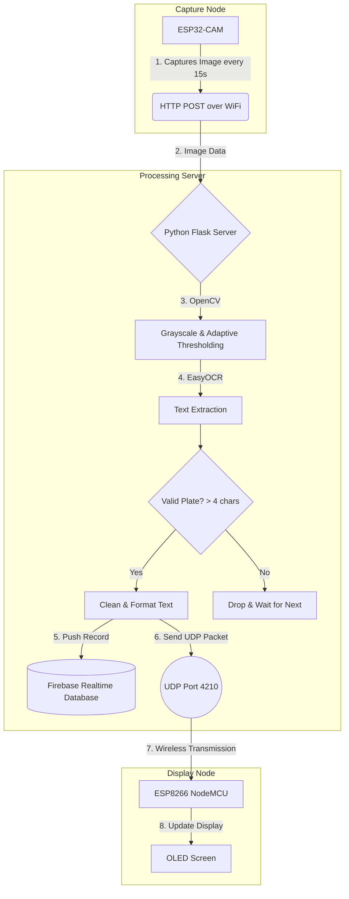

# Smart Parking System

An end-to-end system that automatically captures vehicle license plates using an ESP32-CAM, processes them on a Flask + OpenCV + EasyOCR server, logs them to Firebase, and displays the detected plate on an ESP8266 OLED display.

Step-by-Step Workflow Explanation
Capture
The ESP32-CAM acts as the remote camera module.  
Every 15 seconds, it automatically captures a high-resolution (VGA) frame.

Transmit
It sends this frame as multipart form data via an HTTP POST request to the IP address of the local PC Server.

Pre-Process
The Flask Server receives the image bytes.  
It uses OpenCV to:
• Convert the image to grayscale
• Apply adaptive thresholding  

This creates a high-contrast black-and-white image for improved OCR accuracy.

OCR (Text Extraction)
EasyOCR scans the pre-processed image for alphanumeric characters.

Validate
If the detected text is longer than 4 characters:
• Strips out blank spaces  
• Converts the string to uppercase

Log to Cloud
The server pushes the finalized plate text and a timestamp to a Firebase Realtime Database for historical logging.

Broadcast
Simultaneously, the server sends the plate string wirelessly via UDP (Port 4210) to the ESP8266.

Display
The ESP8266 intercepts the packet and updates the 0.96" OLED screen with:  
> “VEHICLE DETECTED”  
> [LICENSE PLATE]

🛠️ Hardware Requirements
• ESP32-CAM (AI-Thinker module) + FTDI Programmer  
• ESP8266 (NodeMCU, Wemos D1 Mini, etc.)  
• 0.96" OLED Display (SSD1306 I2C)  
• PC/Server (Capable of running Python 3 and OpenCV)  
• 2.4GHz WiFi Router (All devices must share the same network)

Setup Instructions
Python Processing Server (ocrserver.py)

Install Dependencies:

``bash
pip install flask easyocr opencv-python numpy firebase-admin
`

Firebase Setup:  
Download your serviceAccountKey.json from Firebase and place it in the script directory.

Configure IP:  
Update the ESP8266IP variable in the script with your ESP8266’s local IP.

Run the Server:

`bash
python ocrserver.py
`

Camera Node (CameraServ.ino)

Update network credentials:

`cpp
const char ssid = "YOURWIFISSID";
const char password = "YOURWIFIPASSWORD";
const char* pcip = "YOURPCIPADDRESS";
`

Upload Notes:
• Tie GPIO 0 to GND during upload  
• Press the reset button after upload

Display Node (lcd.ino)

Wiring:

| OLED Pin | ESP8266 Pin |
|-----------|-------------|
| VCC       | 3.3V        |
| GND       | GND         |
| SCL       | D1 (GPIO 5) |
| SDA       | D2 (GPIO 4) |

Software Setup:
• Install Adafruit GFX and Adafruit SSD1306 libraries
• Update your WiFi credentials
• Upload the sketch
• Copy the IP from the Serial Monitor into your Python script

⚠️ Important Deployment Notes
• Network Isolation: Ensure all devices are on the same local WiFi network.  
• Firewall: Allow inbound connections on Port 5000 and outbound UDP on Port 4210.  
• Power Supply: The ESP32-CAM is sensitive; use a stable 5V/2A source to prevent brownouts.

Architecture Overview

`
ESP32-CAM → Flask Server (OpenCV + EasyOCR)
        ↓                 ↑
     UDP Broadcast → ESP8266 OLED Display
        ↓
     Firebase Cloud Logging
``

## System Flowchart

